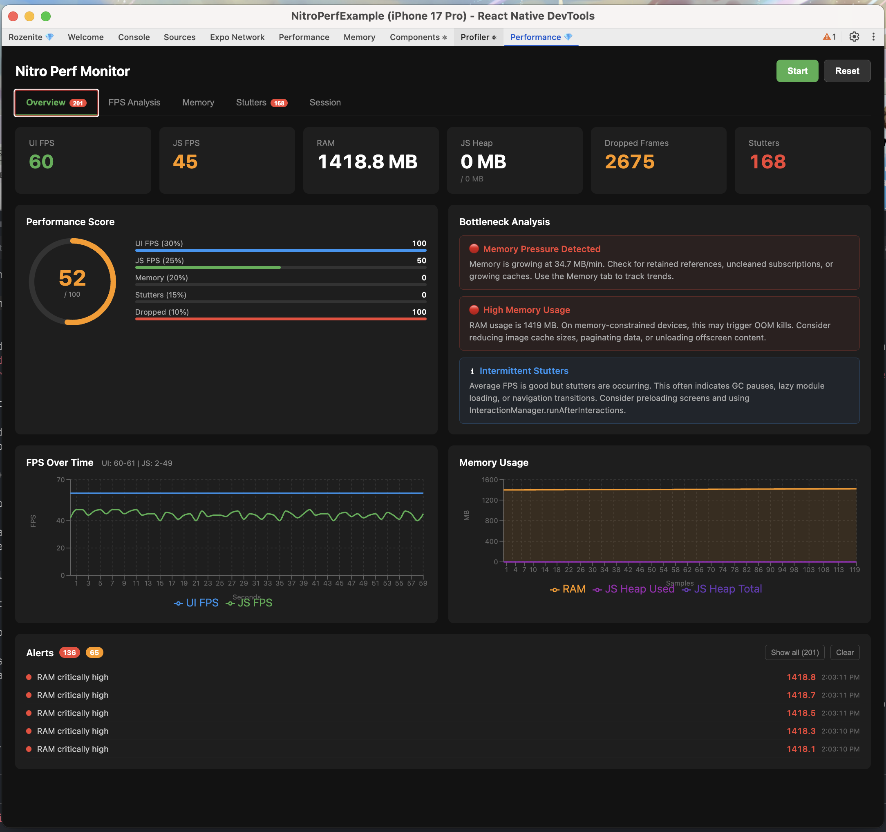
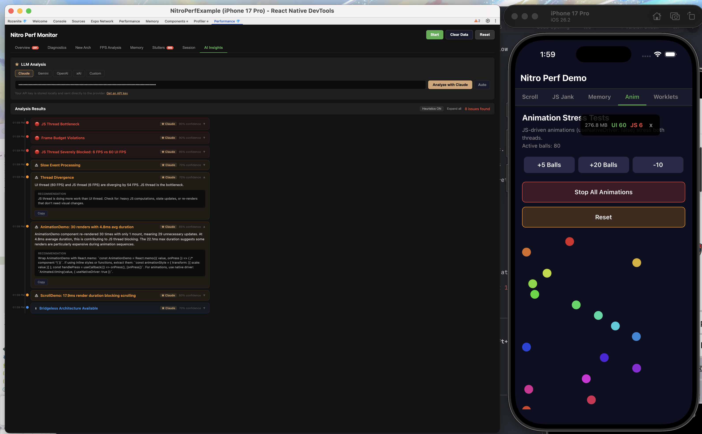

# @nitroperf/core

Hybrid performance monitor for React Native — UI FPS, JS FPS, RAM, JS heap, dropped frames, and stutter detection, powered by [Nitro Modules](https://github.com/nicklockwood/NitroModules).

## Demo


## Architecture

```
┌──────────────────────────────────┐
│  Nitro HybridObject (C++)        │
│  CADisplayLink / Choreographer   │
│  FPSTracker ring buffers         │
│  Memory via Mach/proc APIs       │
├──────────┬───────────────────────┤
│          │                       │
▼          ▼                       ▼
RN Overlay    usePerfMetrics()     Rozenite DevTools
(on-device)   (React hook)         ──► CDP bridge ──► Panel (Recharts)
```

**Three consumption modes:**
1. **On-device overlay** — draggable floating widget showing FPS + RAM
2. **React hook** — `usePerfMetrics()` returns reactive performance state
3. **Rozenite DevTools panel** — rich web charts (FPS line chart, memory area chart, stutter timeline)

## Installation

### 1. Install the package

```bash
npm install -D @nitroperf/core react-native-nitro-modules
```

or with Yarn:

```bash
yarn add -D @nitroperf/core react-native-nitro-modules
```

or with pnpm:

```bash
pnpm add -D @nitroperf/core react-native-nitro-modules
```

or with Bun:

```bash
bun add -D @nitroperf/core react-native-nitro-modules
```

### 2. iOS setup

```bash
cd ios && pod install
```

Requires iOS 13+. The podspec (`NitroPerf.podspec`) is picked up automatically by CocoaPods autolinking.

### 3. Android setup

No extra steps — the native module is autolinked via Gradle. Requires Android SDK 24+ (Android 7.0).

### 4. Expo (managed workflow)

If you're using Expo with a [development build](https://docs.expo.dev/develop/development-builds/introduction/), install with:

```bash
npx expo install @nitroperf/core react-native-nitro-modules
```

Then add the config plugin to your `app.json` / `app.config.js`:

```json
{
  "expo": {
    "plugins": ["@nitroperf/core"]
  }
}
```

Then rebuild your native projects:

```bash
npx expo prebuild --clean
```

> The plugin enables TurboModule interop on iOS, which is required for Nitro Modules in Expo apps.

### 5. (Optional) Rozenite DevTools panel

For browser-based performance charts:

```bash
npm install -D @nitroperf/devtools
```

See the [Rozenite DevTools](#rozenite-devtools) section below for usage.

## Running the Example App

The repo includes an Expo 55 example app that demonstrates the overlay, hook, and DevTools integration.

```bash
# Install dependencies (from the repo root)
npm install

# Generate native projects
npm run example:prebuild

# Run on iOS
npm run example:ios

# Run on Android
npm run example:android

# Or start Metro bundler manually
npm run example:start
```

## Quick Start

```tsx
import { PerfOverlay, usePerfMetrics, registerDevMenuItem } from '@nitroperf/core';

function App() {
  const [showOverlay, setShowOverlay] = useState(true);

  useEffect(() => { registerDevMenuItem(setShowOverlay); }, []);

  return (
    <View style={{ flex: 1 }}>
      <YourApp />
      <PerfOverlay visible={showOverlay} onClose={() => setShowOverlay(false)} />
    </View>
  );
}
```

## API Reference

### `getPerfMonitor(): PerfMonitor`

Returns the singleton Nitro HybridObject. All methods are synchronous JSI calls.

| Method | Description |
|--------|-------------|
| `start()` | Start collecting metrics |
| `stop()` | Stop collecting metrics |
| `isRunning` | Whether the monitor is active |
| `getMetrics()` | Synchronous snapshot: FPS, RAM, heap, drops, stutters |
| `getHistory()` | FPS history ring buffer with min/max |
| `subscribe(cb)` | Register for periodic updates, returns subscription ID |
| `unsubscribe(id)` | Remove a subscription |
| `reportJsFrameTick(ts)` | Feed JS-side rAF timestamps (Android/Fabric) |
| `configure(config)` | Set update interval, history size, target FPS |
| `reset()` | Clear all tracked data |

### `usePerfMetrics(options?): UsePerfMetricsReturn`

React hook that auto-starts the monitor and returns reactive state.

```typescript
const { metrics, history, isRunning, start, stop, reset } = usePerfMetrics({
  autoStart: true,        // default: true
  updateIntervalMs: 500,  // default: 500
  maxHistorySamples: 60,  // default: 60
  targetFps: 60,          // default: 60
});
```

### `<PerfOverlay />`

Draggable floating widget with compact and expanded views.

| Prop | Type | Description |
|------|------|-------------|
| `visible` | `boolean` | Show/hide the overlay |
| `onClose` | `() => void` | Called when close button tapped |
| `initialPosition` | `{ x, y }` | Starting position |

### `registerDevMenuItem(onToggle)`

Adds "Toggle Nitro Perf Monitor" to the React Native Dev Menu.

### `setPerfOverlayVisible(visible: boolean)`

Programmatically control overlay visibility.

## PerfSnapshot

```typescript
interface PerfSnapshot {
  uiFps: number            // UI thread frames per second
  jsFps: number            // JS thread frames per second
  ramBytes: number         // Process resident memory
  jsHeapUsedBytes: number  // JS heap used (Hermes)
  jsHeapTotalBytes: number // JS heap total (Hermes)
  droppedFrames: number    // Total dropped frames
  stutterCount: number     // Seconds with 4+ dropped frames
  timestamp: number        // Millisecond timestamp
}
```

## Rozenite DevTools



For a rich browser-based debugging experience:

```tsx
import { useNitroPerfDevTools } from '@nitroperf/devtools';

function App() {
  useNitroPerfDevTools(); // Bridges metrics to DevTools panel
  return <YourApp />;
}
```

Start with `WITH_ROZENITE=true npm start`, then open DevTools and navigate to the "Performance" tab.

Features:
- Real-time FPS line chart (UI + JS)
- Memory usage area chart (RAM + JS heap)
- Stutter event timeline
- Min/Max/Current statistics table
- Start/Stop/Reset controls

### AI Insights



LLM-powered performance analysis with per-component render tracking. Choose from Claude, Gemini, OpenAI, xAI, or any OpenAI-compatible API. The LLM receives all metrics including per-component render breakdowns and returns actionable, code-level fixes.

## How It Works

### iOS
- **UI FPS**: `CADisplayLink` on `NSRunLoopCommonModes`
- **JS FPS**: `CADisplayLink` on JS thread (bridge) or JS-side `requestAnimationFrame` (Fabric)
- **RAM**: `task_info(TASK_VM_INFO)` → `phys_footprint`

### Android
- **UI FPS**: `Choreographer.FrameCallback` → JNI → C++ FPSTracker
- **JS FPS**: JS-side `requestAnimationFrame` → `reportJsFrameTick()`
- **RAM**: `/proc/self/status` → `VmRSS`

### FPS Algorithm
Same approach as React Native's built-in `RCTFPSGraph.mm`: count frame callbacks per 1-second window, compute `round(frameCount / elapsed)`. Ring buffer stores last N seconds of samples.

## Project Structure

```
packages/
  core/                         # Nitro module (npm: @nitroperf/core)
    cpp/                        # Shared C++ (FPSTracker, PlatformMetrics, HybridPerfMonitor)
    src/                        # TypeScript (specs, hook, overlay, dev menu)
    ios/                        # iOS-specific files
    android/                    # Android build + Kotlin Choreographer helper
  devtools/                     # Rozenite plugin (npm: @nitroperf/devtools)
    src/                        # DevTools panel (React + Recharts)
    react-native.ts             # App-side bridge hook
```

## Requirements

- React Native >= 0.73
- react-native-nitro-modules >= 0.19.0
- iOS 13+
- Android SDK 24+

## License

MIT
