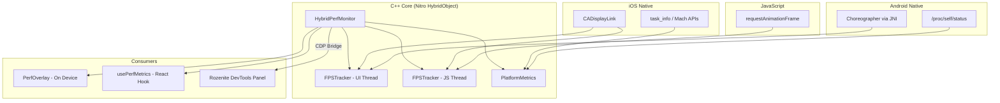

# Introduction

**@nitroperf/core** is a hybrid performance monitor for React Native that tracks UI FPS, JS FPS, RAM, JS heap, dropped frames, and stutter detection, powered by [Nitro Modules](https://github.com/mrousavy/nitro).

## Three Consumption Modes

1. **On-device overlay** — draggable floating widget showing FPS + RAM
2. **React hook** — `usePerfMetrics()` returns reactive performance state
3. **Rozenite DevTools panel** — rich web charts (FPS line chart, memory area chart, stutter timeline)

  

## Architecture

## Requirements

- React Native >= 0.73
- react-native-nitro-modules >= 0.19.0
- iOS 13+
- Android SDK 24+
